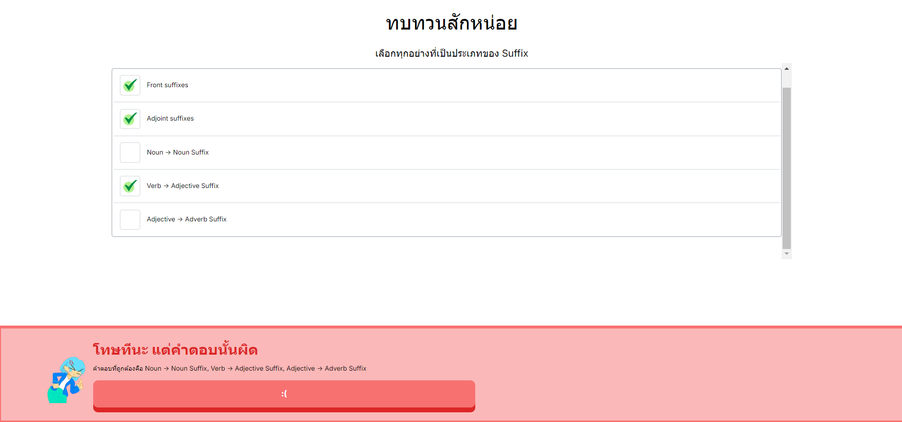

Got 3 minutes? Learn your English lessons today at Thringo! Yes, you didn't hear it wrong. Thringo, not Duolingo
 
พอมีเวลาสัก 3 นาทีไหม? เรียนบทเรียนภาษาอังกฤษของคุณได้วันนี้ที่ Thringo ใช่ คุณฟังไม่ผิดหรอก Thringo ไม่ใช่ Duolingo

# Learn English with Andy!
Normally in Duolingo, there is a well-known green owl character that will be your guidance. But this is not duolingo, so it's instead a girl teacher named "Andy" who will teach you through out the English course.
 
โดยปกติใน Duolingo จะมีตัวละครนกฮูกสีเขียวที่เป็นที่รู้จักกันดีคอยให้คำแนะนำ แต่นี่ไม่ใช่ Duolingo ดังนั้นจึงเป็นครูสาวชื่อ Andy ที่จะเป็นคนสอนคุณในคอร์สนี้แทน

# Overview

After the user has registered and selected their lessons to learn, they'll be brought to the lobby page as you can see. The page contains a various number of levels line up diagonally. It's designed to look as close as Duolingo as possible though.
 
หลังจากผู้ใช้ได้ลงทะเบียนเข้าใช้งานและเลือกบทเรียนที่จะเรียน ผู้ใช้จะถูกพาไปที่หน้าล็อบบี้ ซึ่งมีด่านต่างๆเรียงไปมาแบบเฉียงๆ มันถูกออกแบบให้ดูเหมือน Duolingo มากที่สุด

The navigation bar on the top tells the user which lesson they're currently studying. You can change to another lesson that you've selected or select new lessons to learn as well. But there is only one lesson availalbe at the moment. So this feature hasn't been fully developed yet.
 
แถบนาวิเกชันด้านบนบอกผู้ใช้ถึงบทเรียนที่กำลังเรียนอยู่ คุณสามารถเปลี่ยนไปเรียนบทเรียนอื่นที่คุณเลือกไว้หรือเลือกเรียนในบทเรียนใหม่ได้เช่นกัน แต่ในขณะนี้มีเพียงบทเรียนเดียวที่พร้อมให้เรียน เพราะฉะนั้นฟีเจอร์นี้จึงยังไม่ได้พัฒนาให้สมบูรณ์แบบ

Apart from that, it also tells you the number of levels in the lesson and the number of levels you've completed on the right side.
 
นอกจากนั้นแล้ว แถบนาวิเกชันยังบอกคุณถึงจำนวนด่านที่มีในบทเรียนและจำนวนด่านที่คุณผ่านที่ด้านขวาของแถบ

## Type of levels
There are two type of levels. The lecture level which gives you explanations about the lesson and examples of word usage. And the quiz level which allows user to pick choices to answer questions that are related to the lesson. The purpose of quiz levels are obviously to give user revision about the lesson they've learned
 
มีด่านอยู่ 2 ประเภท ได้แก่ ด่านประเภทบรรยายซึ่งให้คำอธิบายเกี่ยวกับบทเรียนและตัวอย่างการใช้คำศัพท์ และด่านประเภทแบบทดสอบซึ่งให้ผู้ใช้เลือกคำตอบสำหรับคำถามที่เกี่ยวข้องกับบทเรียน จุดประสงค์ของแบบทดสอบคือเพื่อให้ผู้ใช้ทบทวนบทเรียนที่ได้เรียนรู้

An example image of a lecture level.
ภาพตัวอย่างด่านประเภทบรรยาย

An example image of a quiz level
ภาพตัวอย่างด่านประเภทแบบทดสอบ

## XP System
The XP system is made to encourage users to continue learning the lesson. However, it needs to work with the leaderboard system and the membership system which haven't been developed yet. But those will be in the next update for sure. Right now, you gain XP after you complete a level. The number of XP is various in each level. You may have a chance to gain no XP if all of your answers are wrong in a quiz level.
 
ระบบ XP ถูกสร้างขึ้นมาเพื่อสนับสนุนให้ผู้ใช้เรียนรู้บทเรียนต่อไป อย่างไรก็ตาม ระบบนี้จำเป็นต้องทำงานร่วมกับระบบ Leaderboard และระบบสมาชิกซึ่งยังไม่ได้รับการพัฒนา แต่สิ่งเหล่านี้จะอยู่ในอัปเดตครั้งต่อไปอย่างแน่นอน ตอนนี้คุณจะได้รับ XP หลังจากผ่านด่านหนึ่ง จำนวน XP จะแตกต่างกันไปในแต่ละด่าน คุณอาจมีโอกาสไม่ได้รับ XP หากคำตอบทั้งหมดของคุณผิดในด่านแบบทดสอบ

# Data Management
User data are stored in the form of cookies, and they will expire after the user becomes inactive for more than one day. This was intended to be as I planned to create the membership system back then, but couldn't do it on time. For now, every user is registered as a "Guest", and as said, the data will be deleted after the user is inactive for more than one day.
 
ข้อมูลผู้ใช้จะถูกเก็บไว้ในรูปแบบของคุกกี้ และคุกกี้จะหมดอายุลงเมื่อผู้ใช้ไม่ได้ใช้งานเกินหนึ่งวัน ซึ่งฉันตั้งใจให้เป็นเช่นนั้นเนื่องจากฉันเคยวางแผนจะสร้างระบบสมาชิกไว้แล้ว แต่ไม่สามารถทำได้ทันเวลา ในตอนนี้ ผู้ใช้ทุกคนลงทะเบียนเป็น "แขก" และตามที่กล่าวไว้ ข้อมูลจะถูกลบออกเมื่อผู้ใช้ไม่ได้ใช้งานเกินหนึ่งวัน

# Tools used for development
Thringo is developed on Next.js framework. The code is written in TypeScript. For styling the UI, I use Tailwind CSS framework with vanilla CSS
 
Thringo ได้รับการพัฒนาบนเฟรมเวิร์ก Next.js โดยโค้ดเขียนด้วย TypeScript สำหรับการออกแบบ UI ฉันใช้เฟรมเวิร์ก Tailwind CSS กับ CSS แบบธรรมดา

Lastly, I want to thank you for being interested in my project. I aim this to be one of the best English learning apps that you'd love to use.
 
สุดท้ายนี้ ฉันอยากจะขอบคุณที่คุณสนใจโครงการของฉัน ฉันตั้งเป้าว่านี่จะเป็นแอปเรียนภาษาอังกฤษที่ดีที่สุดแอปหนึ่งที่คุณอยากใช้

Andy artworks are credited to [Pira](https://www.facebook.com/pira.somabhira.9)